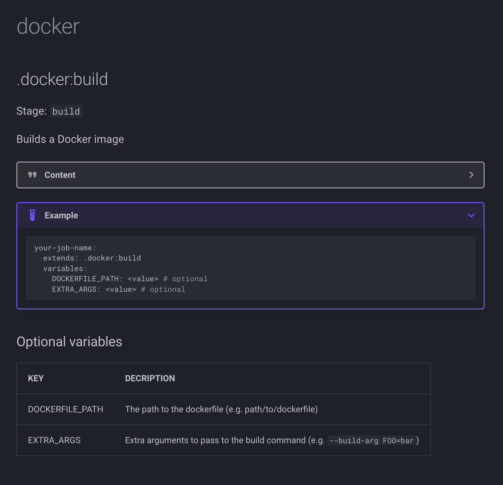

Empowering developers to manage their own CI/CD pipelines is crucial. We are seeing a lot of advancements in the platform engineering areas, providing self-serve systems, which means it must be working!

At Nexxen, We've implemented a robust system using custom-made GitLab CI/CD templates that allows developers to build and manage their own pipelines effortlessly. This self-serve system not only accelerates the development process but also ensures consistency and best practices across all projects.

In this blog post, I'll walk you through how we achieved this, including our self-documenting system that generates documentation for all CI/CD templates.

## The Power of GitLab CI/CD Templates

GitLab CI/CD templates are reusable steps that can be included in multiple projects. By creating a library of these templates, we provide developers with a set of predefined jobs and stages that they can easily include in their `.gitlab-ci.yml` files.

This approach ensures that all pipelines adhere to the company's standards and best practices, and allows the operation teams to roll out company-wide changes and improvements.

## The Inner Workings

We constructed a monorepo that consists of all our CI/CD templates, defined in respective YAML files, and a `root.yml` file that includes all our templates and defines common variables and stages, like so:

```yaml
variables:
  IMAGE_TAG: ${CI_COMMIT_SHORT_SHA}
  IMAGE_NAME: ${CI_PROJECT_NAME}:${IMAGE_TAG}
  # -- snip --

stages:
  - test
  - analyze
  - build
  # -- snip --

include:
  - 'utilities/*.yml'
  - 'templates/**/*.yml'
  # -- snip --
```

And an example of a step template:

```yaml
# Description: Send a Slack message
# RequiredExtensions:
#   stage: The stage in which the step runs
# RequiredVariables:
#   SLACK_WEBHOOK: Slack webhook URL
#   MESSAGE: Message content in markdown, with support for Gomplate templating
.slack:send-message:
  image: organization/image
  variables:
    SLACK_WEBHOOK: ''
    MESSAGE: ''
  script:
    - |
      cat <<'EOF' > notification_template
      {
        "text": "{{ .MESSAGE }}"
      }
      EOF
    - renderkit -f notification_template -ds env:// > notification.json
    - 'curl -X POST -H "Content-type: application/json" --data @notification.json ${SLACK_WEBHOOK}'
```

*Shameless plug: We use [Render Kit](https://github.com/orellazri/renderkit) to render templates, which is a handly tool that I developed, check it out!*

## Example of Using Templates

For developers to use our templates, all they have to do is create steps that extend the template, like so:

```yaml
docker-build:
  extends: .docker:build
```

Developers can also extend these templates to add additional steps or override existing values. For instance, if a developer wants to build a Maven-based project with a specific image of Maven and apply additional rules, they can extend the template and specify a custom Docker image:

```yaml
maven-build:
  extends: .maven:build
  image: maven:3.9.4-amazoncorretto-20
  rules:
    - if: $CI_PIPELINE_SOURCE == "merge_request_event"
      when: manual
```

## Self-Documenting System

To make it easier for developers to understand and use our templates, we built a self-documenting system. Each template is annotated with metadata in the form of commented YAML. This metadata is parsed and used to generate markdown documentation that describes each template.

Here's an example of a template with metadata annotations:

```yaml
# Description: Builds a Docker image
# OptionalVariables:
#   DOCKERFILE_PATH: The path to the dockerfile (e.g. path/to/dockerfile)
#   EXTRA_ARGS: Extra arguments to pass to the build command (e.g. `--build-arg FOO=bar`)
.docker:build:
```

We developed a tool in Go that reads the template directories, parses the metadata from the templates, and generates markdown files, which we then serve using MkDocs.

Each template can include documentation for optional and requires variables, stage definition, and more.
The resulting documentation shows how to use each template, with practical examples and explanations.

The output, when rendered by MkDocs, looks like this:


By implementing generic templates in GitLab, we have empowered our developers to build and manage their own CI/CD pipelines. This self-serve system not only accelerates the development process but also ensures consistency and best practices across all projects.
